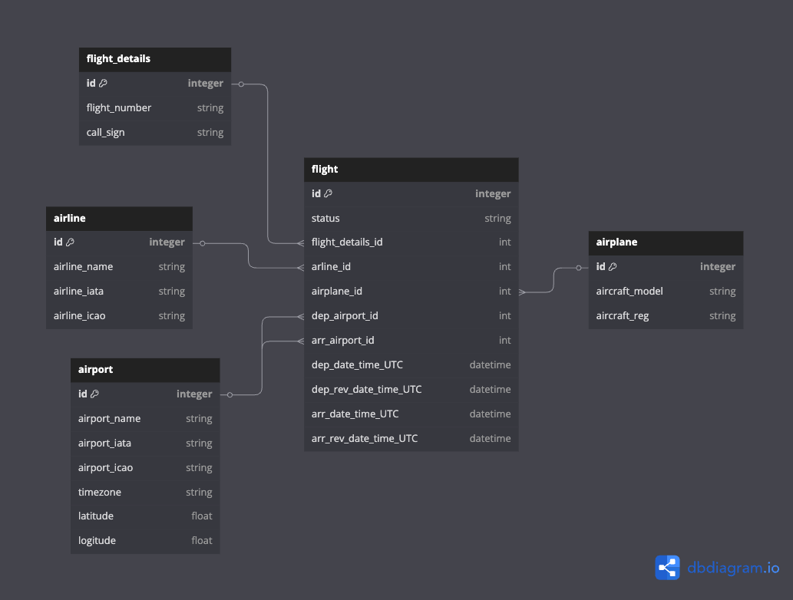

# Flights

This project provides tools for analyzing flight data using the [Aerodatabox API](https://rapidapi.com/aedbx-aedbx/api/aerodatabox).

## Features

- Fetch and analyze flight data.
- Automatically populate a database with flight-related information.
- Database schema includes airlines, airports, airplanes, and flight details.
- Import and process CSV flight data.
- Airport mapping utilities (see `airport_map.py`).

## Setup Instructions

1. Clone the repository:

   ```bash
   git clone https://github.com/konradflis/Flights.git
   cd Flights
   ```

2. Install dependencies using Poetry:

   ```bash
   poetry install
   ```

3. Run the scripts to insert data from CSV and populate the database:

   ```bash
   python main.py
   ```

4. The database will be created in the same directory as the script.

## Database Schema

Below is a visual representation of the SQLite database schema used in this project:



## Usage

- Run the scripts to populate the database.
- Use the database for querying and analyzing flight information.
- You can add or update airport mappings in `airport_map.py` as needed.

## Notes

- Ensure you have an API key for the Aerodatabox API and configure it in the script.
- The database schema is designed to support relational queries for efficient data analysis.
- CSV data files should be placed in the `csv_data` directory.
- The project uses Python and Poetry for dependency management.
